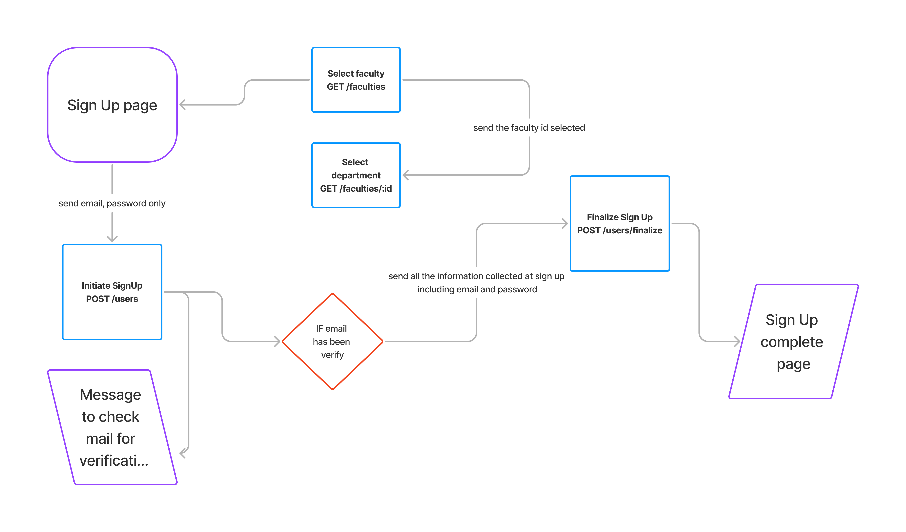

# PROJECT GENIUS API DOCUMENTATION

**BaseUrl** = *https://project-genius-back-end.onrender.com*  
>[!Note] 
All POST, PATCH, PUT uses header `Content-Type: application/json`

## <span style="color:blue"> Sign Up Flow Endpoint</span>



- ### <span style="color: green"> POST</span> SignUp Initiation
    - **Method**: `POST`
    - **URL**: `BaseUrl/users`
    - **Description** : Initiate Sign Up

    - **Body**: 
        ```javascript
        {
            email,
            password,
        }
        ```
    - **Return**:
        - _<span style="color: green">Success</span>_  
            - status: 200  
            - response: ` { "message": "Verify email to complete SignUp" }`  
        - _<span style="color: red">Error</span>_
            400
            ```javascript

            { error: "Missing email"} //when email is missing
            { error: "Missing password"} // when password is missing
            ```  
            409
            ```javascript
            {error: "User already registered"} // when an existing email is used
            ```

- ### <span style="color: green"> POST</span> SignUp Finale
    - **Method**: `POST`
    - **URL**: `BaseUrl/users/finalize`
    - **Description** : finalize Sign Up

    - **Body**: 
        ```javascript
        {
            email,
            password,
            firstName,
            lastName,
            role,
            departmentId,
            phone
        }
        ```
    - **Return**:
        - _<span style="color: green">Success</span>_  
            - status: 200  
            - response: ` { "message": "SignUp complete" }`  
        - _<span style="color: red">Error</span>_
            400
            ```javascript

            { error: "Missing email" } //when email is missing
            { error: "Missing password" } // when password is missing
            { error: "Missing role" } // when role is missing
            { error: "Missing departmentId"} // when departmentId is missing
            { error: "Invalid role selected"} // when role is not member or lead
            ```

- ### <span style="color: green"> GET</span> List all available  faculty
    - **Method**: `POST`
    - **URL**: `BaseUrl/faculties`
    - **Description** : retrieves all available faculty
    - **Return**:
        - _<span style="color: green">Success</span>_  
            - status: 200  
            - response: _list of all faculties_
            ```
            [{
                id,
                name,
            }]
            ```

- ### <span style="color: green"> GET</span> List all department by faculty
    - **Method**: `POST`
    - **URL**: `BaseUrl/faculties/:id`
    - **Description** : retrieve all departments belonging to a faculty

    - **param**: id - id of a valid faculty
    - **Return**:
        - _<span style="color: green">Success</span>_  
            - status: 200  
            - response: _list of all department for that faculty id_
            ```
            [{
                id,
                name,
            }]
            ```
        - _<span style="color: red">Error</span>_
            400
            ```javascript
            { error: "id should be a number"} // when id is not a number
            ```  
