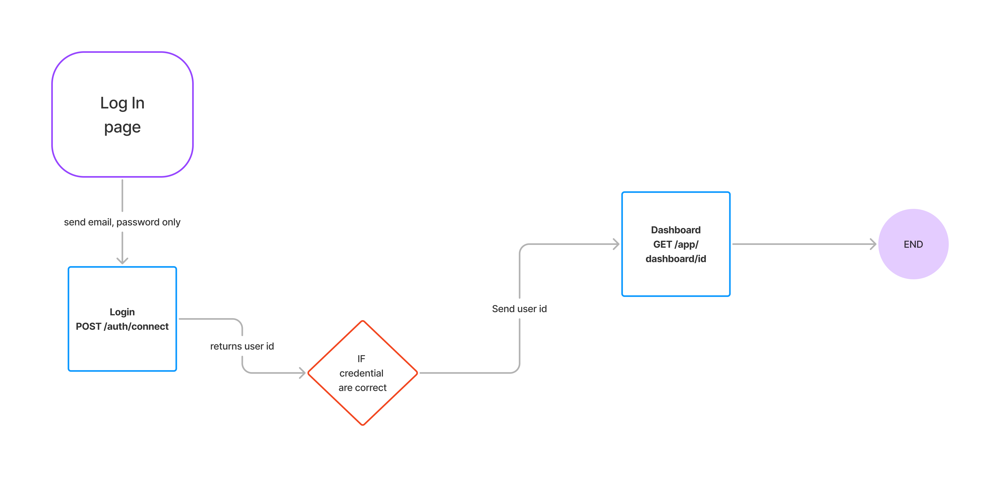
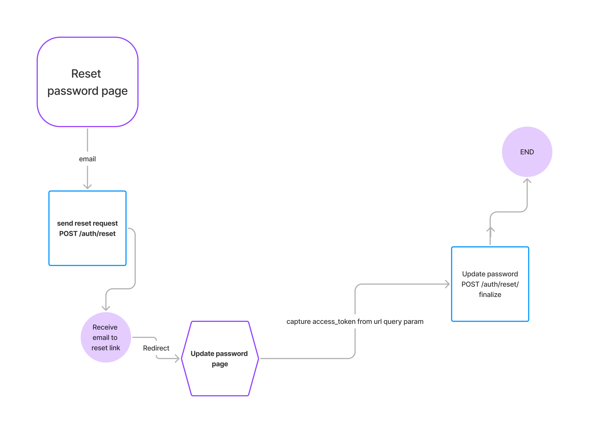

# PROJECT GENIUS API DOCUMENTATION

**BaseUrl** = *https://project-genius-back-end.onrender.com*  
>[!Note] 
All POST, PATCH, PUT uses header `Content-Type: application/json`

## <span style="color:blue"> Sign Up Flow Endpoint</span>


- ### <span style="color: green"> POST</span> SignUp Initiation
    - **Method**: `POST`
    - **URL**: `BaseUrl/users`
    - **Description** : Initiate Sign Up

    - **Body**: 
        ```javascript
        {
            email,
            password,
        }
        ```
    - **Return**:
        - _<span style="color: green">Success</span>_  
            - status: 200  
            - response: ` { "message": "Verify email to complete SignUp" }`  
        - _<span style="color: red">Error</span>_
            400
            ```javascript

            { error: "Missing email"} //when email is missing
            { error: "Missing password"} // when password is missing
            ```  
            409
            ```javascript
            {error: "User already registered"} // when an existing email is used
            ```

- ### <span style="color: green"> POST</span> SignUp Finale
    - **Method**: `POST`
    - **URL**: `BaseUrl/users/finalize`
    - **Description** : finalize Sign Up

    - **Body**: 
        ```javascript
        {
            email,
            password,
            firstName,
            lastName,
            role,
            departmentId,
            phone
        }
        // role is either lead or member
        ```
    - **Return**:
        - _<span style="color: green">Success</span>_  
            - status: 201  
            - response: ` { "message": "SignUp complete" }`  
        - _<span style="color: red">Error</span>_
            400
            ```javascript

            { error: "Missing email" } //when email is missing
            { error: "Missing password" } // when password is missing
            { error: "Missing role" } // when role is missing
            { error: "Missing departmentId"} // when departmentId is missing
            { error: "Invalid role selected"} // when role is not member or lead
            ```
            403
            ```javascript
            { error: "Email not confirmed" }// when email has not been verified
            ```

- ### <span style="color: green"> GET</span> List all available  faculty
    - **Method**: `GET`
    - **URL**: `BaseUrl/faculties`
    - **Description** : retrieves all available faculty
    - **Return**:
        - _<span style="color: green">Success</span>_  
            - status: 200  
            - response: _list of all faculties_
            ```
            [{
                id,
                name,
            }]
            ```

- ### <span style="color: green"> GET</span> List all department by faculty
    - **Method**: `GET`
    - **URL**: `BaseUrl/faculties/:id`
    - **Description** : retrieve all departments belonging to a faculty

    - **param**: id - id of a valid faculty
    - **Return**:
        - _<span style="color: green">Success</span>_  
            - status: 200  
            - response: _list of all department for that faculty id_
            ```
            [{
                id,
                name,
            }]
            ```
        - _<span style="color: red">Error</span>_
            400
            ```javascript
            { error: "id should be a number"} // when id is not a number
            ```  
## <span style="color:blue"> Login Flow Endpoints</span>

- ### <span style="color: green"> POST</span> Login
    - **Method**: `POST`
    - **URL**: `BaseUrl/auth/connect`
    - **Description** : login a user to the application

    - **body**:
        ```javascript
         {
            email,
            password,
         }
        ```
    - **Return**:
        - _<span style="color: green">Success</span>_  
            - status: 200  
            - response: returns id of user
            ```
            {
                userId,
            }
            ```
        - _<span style="color: red">Error</span>_
            400
            ```javascript
            { error: "Missing email" } // when no email is sent in body
            { error: "Missing password" } // whwen no password is sent
            { error: "Invalid login credentials" } // when either password or email or both is wrong
            ```  

- ### <span style="color: green"> GET </span> User dashboard
    - **Method**: `GET`
    - **URL**: `BaseUrl/app/dashboard/:id`
    - **Description** : user dashboard info
    - **param**: id - user id returned at sign in
    - **Return**:
        - _<span style="color: green">Success</span>_  
            - status: 200  
            - response: returns details that includes
            ```javascript
            //if user has a team
            {
                currentStage, // curentStage is either registration, prototype,finale or post
                team: [{ 
                        user_id, 
                        first_name,
                        role,
                        initials
                    }],
                owner: {
                    name,
                    initials
                }
            } 

            //if user has no team but role is member
            {
                message: "please join a team"
            }

            //if user has no team but role is lead
            {
                message: "please create a team"
            }
            
            ```
        - _<span style="color: red">Error</span>_
            401
            ```javascript
            { error: "Invalid login Id" } // when id is not a for a valid login user
            ```  
## <span style="color:blue"> Login Out Endpoint</span>
- ### <span style="color: green"> DELETE</span> LogOut
    - **Method**: `DELETE`
    - **URL**: `BaseUrl/auth/disconnect`
    - **Description** : login a user to the application
    - **Return**:
        - _<span style="color: green">Success</span>_  
            - status: 204
            - response: empty
    

## <span style="color:blue"> Reset Password Flow Endpoints</span>


- ### <span style="color: green"> POST</span> Initiate reset password
    - **Method**: `POST`
    - **URL**: `BaseUrl/auth/reset`
    - **Description** : initiate the reset password functionality

    - **Body**: 
        ```javascript
        {
            email,
        }
        ```
    - **Return**:
        - _<span style="color: green">Success</span>_  
            - status: 200  
            - response: ` { "message": "Check your email for reset link" }`  
        - _<span style="color: red">Error</span>_
            400
            ```javascript

            { error: "Missing email"} //when email is missing
            ```  

- ### <span style="color: green"> POST</span> reset Finale
    - **Method**: `POST`
    - **URL**: `BaseUrl/auth/reset/finalize`
    - **Description** : finalize Sign Up

    - **Body**: 
        ```javascript
        {
            password,
            accessToken, //accessToken is extracted from the redirection page user gets in the email
        }
        ```
    - **Return**:
        - _<span style="color: green">Success</span>_  
            - status: 201 
            - response: ` { "message": "Password updated" }`  
        - _<span style="color: red">Error</span>_
            400
            ```javascript

            { error: "Missing password" } // when password is missing
            { error: "Missing accessToken" } // when accessToken is missing
            ```
            401
            ```javascript
            { error: "Unauthorized" } // not a valid accessToken
            ```
## <span style="color:blue"> Update Profile Endpoint</span>
- ### <span style="color: green">PATCH</span> Update profile information
    - **Method**: `PATCH`
    - **URL**: `BaseUrl/users/:id`
    - **Description** : updates user profile information

    - **param**: id - id of login user
    - **Return**:
        - _<span style="color: green">Success</span>_  
            - status: 200  
            - response: `{ message: Update was successful}`
        - _<span style="color: red">Error</span>_
            400
            ```javascript
            { error: "id not a valid uuid" } // when id is not a uuid
            ```
            401
            ```javascript
            { error: "Unauthorized" }
            ```
            404
            ```javascript
            { error: "User not found" }
            ```  